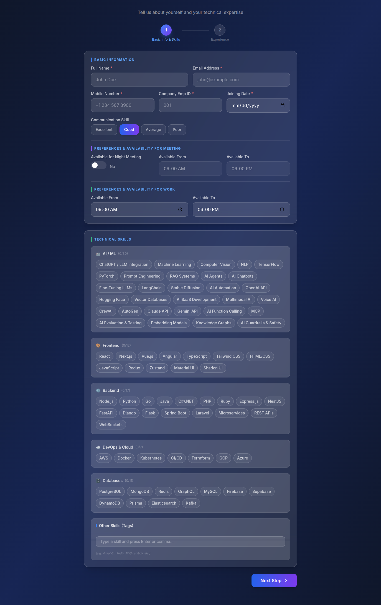
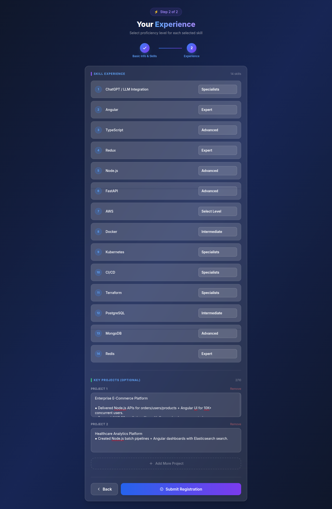
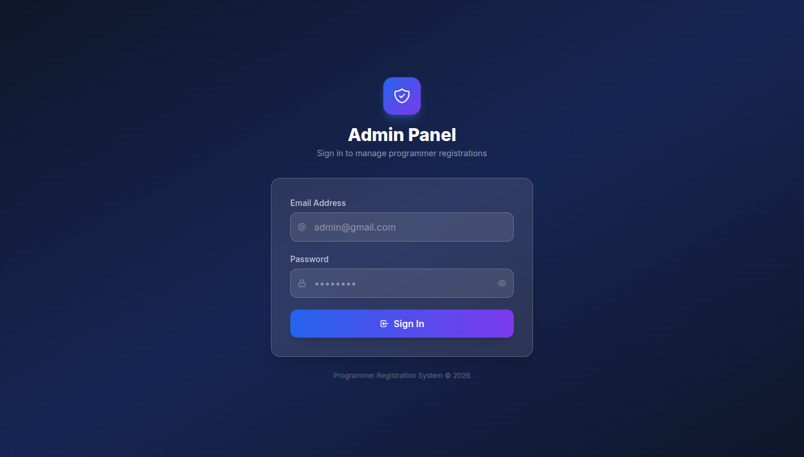
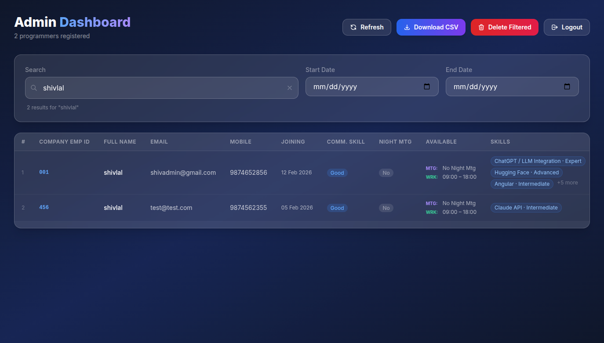

# Programmer Registration System

A comprehensive web application for managing programmer registrations, featuring a multi-step registration form and an administrative dashboard.

## Technology Stack

### Frontend
- **React**: Modern UI library for building the user interface.
- **Vite**: Fast build tool and dev server.
- **Tailwind CSS**: Utility-first CSS framework for styling.
- **React Router Dom**: For navigation and routing.
- **React Hot Toast**: For elegant notifications.
- **PapaParse**: CSV parsing and generation.

### Backend
- **Node.js & Express**: Scalable server-side environment and web framework.
- **MongoDB & Mongoose**: NoSQL database for flexible data storage.
- **JSON Web Token (JWT)**: For secure API authentication.
- **Bcryptjs**: Password hashing for security.

## Key Features

- **Multi-step Registration**: User-friendly form for collecting personal and professional details.
- **Skill Proficiency Tracking**: Capture programmer skills and their respective proficiency levels.
- **Custom Skills**: Allow users to add skills not listed in the defaults.
- **Admin Dashboard**:
  - Secure login for administrators.
  - View and manage all registrations.
  - Detailed view of each programmer's profile.
  - Date-based filtering for registrations.
  - CSV Export functionality for data analysis.
  - Bulk management of records.
- **Duplicate Prevention**: intelligent checks to prevent multiple registrations with the same email or phone number.

## 📸 Screenshots & Demo

Here's a visual tour of the application:






## How to Start

### Prerequisites
- Node.js installed.
- MongoDB instance running.
- Firebase project configured (for authentication).

### 1. Backend Setup
Navigate to the `server` directory and install dependencies:
```bash
cd server
npm install
```
Create a `.env` file in the `server` directory and add your MongoDB and Firebase configurations.

Start the backend server:
```bash
npm run dev
```

### 2. Frontend Setup
Navigate to the root directory and install dependencies:
```bash
npm install
```
Start the frontend development server:
```bash
npm run dev
```

The application will be available at `http://localhost:5173`.

---
*Built with ❤️ for the Programmer Community.*
